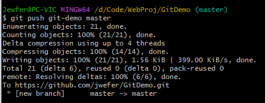

# Git分布式版本控制工具

## 1. 概述

### 1.1 开发中的实际场景

- 备份
- 代码还原
- 协同开发
- 追溯问题代码的编写人和编写时间

### 1.2 版本控制方式

- 集中式版本控制工具：SVN和CVS
  - 版本库集中存放在中央服务器，必须联网才能工作，修改后再提交到中央版本库
- 分布式版本控制工具：Git
  - 版本库在个人电脑上，无需联网，多人协作只需将各自的修改推送给对方即可

### 1.3 SVN


### 1.4 Git


Git工作流程图


## 2. Git安装与常用命令

linux基本命令：

- ls/ll 查看当前目录
- cat 查看文件内容
- touch 创建文件
- vi vi编辑器，`a`进入编辑模式，`esc`退出编辑模式，`:wq` 保存并退出，`:q!`直接退出

### 3.1 基本配置

1. 打开Git Bash

2. 设置用户信息

   > git config --global user.name "xxx"
   >
   > git config --global user.email "xxx"

3. 查看配置信息

   > git config --global user.name
   >
   > git config --global user.email
   >
   

### 3.2 为常用指令配置别名

   1. 打开用户目录，`touch ~/.bashrc`创建`.bashrc`文件

   2. `vi ~/.bashrc` 输入以下内容

      ```bash
      #用于输出git提交日志
      alias git-log='git log --pretty=oneline --all --graph --abbrev-commit'
      #用于输出当前目录所有文件及基本信息
      alias ll='ls -al'
      ```
   3. 打开gitBash，执行`source ~/.bashrc`

### 3.3 获取本地仓库

1. 在电脑任意位置创建一个空目录作为本地Git仓库

2. 进入该目录，点击右键打开Git bash窗口

3. 执行命令 `git init`初始化本地库

4. 查看文件夹下的所有文件，可以看到隐藏的.git目录

   

### 3.4 基础操作指令


状态之间的转换：

> git add   工作区 --> 暂存区
>
> git commit    暂存区 --> 本地仓库

#### 3.4.1 查看修改的状态（status）

- 命令形式：`git status`

#### 3.4.2 添加工作区到暂存区（add）

- 命令形式：`git add 单个文件名|通配符`
  - 将所有修改加入暂存区：`git add`
  


- `git add --all` ：提交全部文件

#### 3.4.3 提交暂存区到本地仓库（commit）

- 命令形式：`git commit -m '日志信息' 文件名`


- `git commit -m 'add more files'`

#### 3.4.4 查看提交日志（log）

（在[3.2](###3.2 为常用指令配置别名)中配置的别名`git-log` 就包含了这些参数，所以可以直接使用指令`git-log` ）

- 命令形式：
  
  - 查看详细日志：`git log [option]`
    - options
      - --all 显示所有分支
      - --pretty=oneline 将提交信息显示为一行
      - --abbrev-commit 使得输出的commitld更简短
      - --graph 以图的形式显示
  
  
  - 查看简略日志：`git reflog`

#### 3.4.5 版本回退（切换）

- 命令形式：`git reset --hard commitID`
  - commitID可以使用`git-log`或`git log`指令查看

- 查看已经删除的记录
  - `git reflog`

#### 3.4.6 添加文件至忽略列表

在工作目录创建`.gitignore`文件，列出要忽略的文件模式

```bash
# no .a files
*.a
# but do track lib.a, even though you're ignoring .a files above
!lib.a
# only ignore the TODO file in the current directory, not subdir/TODO
/TODO
# ignore all files in the build/ directory
build/
# ignore doc/notes.txt, but not doc/server/arch.txt
doc/*.txt
# ignore all .pdf files in the doc/ directory
doc/**/*.pdf
```

### 3.5 分支

1. 查看本地分支：git branch -v
2. 创建本地分支：git branch 分支名
3. 切换分支：git checkout 分支名
4. 创建并切换分支：git checkout -b 分支名
5. 合并分支（一个分支上的提交可以合并到另一个分支）：git merge 分支名
6. 删除分支：不能删除当前分支，只能删除其他分支
   - git branch -d b1 删除分支时，需要做各种检查
   - git branch -D b1 强制删除

7. 产生冲突
   - 原因：合并分支时，两个分支在同一个文件的同一个位置有两套完全不同的修改，需要人为决定新代码内容
   - 手动合并后需将文件添加到暂存库并提交到本地仓库，此时commit后不能带文件名

## 4. Git远程仓库（github）

github官网：https://github.com

### 4.1 创建远程库及别名

1. 登录后点击右上角 + 号，new repository创建远程仓库，仓库名和项目名最好一致
2. 创建别名
   - 查看别名：`git remote -v`
   - 创建别名：`git remote add xxx 远程仓库地址`


### 4.2 推送本地分支到远程仓库

- 语法：git push 仓库别名/仓库链接 分支

### 4.3 拉取远程库到本地库

- 语法：git pull 仓库别名/仓库链接 分支

### 4.4 克隆远程仓库到本地

- 语法：git clone 远程仓库链接
- clone会做如下操作：
  - 拉取代码
  - 初始化本地仓库
  - 自动创建别名：origin

### 4.5 跨团队协作

1. 进入别的团队的github远程仓库，点击右上角fork进行叉取
2. 可以对代码进行修改和提交到本地库
3. 点击pull request，发送拉取请求给对方团队的创建者
4. 对方收到之后，审核无误即可点击merge pull request进行合并

### 4.6 SSH免密登录

1. 进入当前用户的目录下，打开git bash
2. 运行命令生成.ssh密钥目录：`ssh-keygen -t rsa -C github账号邮箱`

3. 

## 5. vs使用git

直接pull远程库到本地
