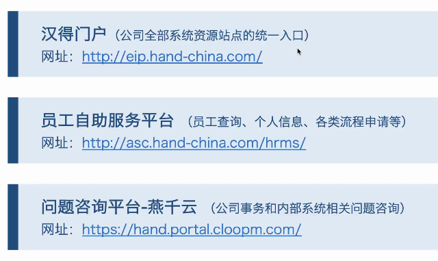
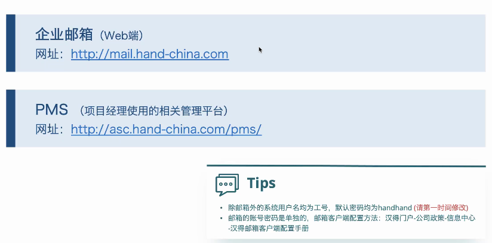
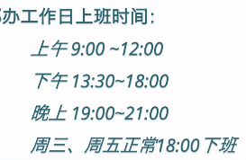
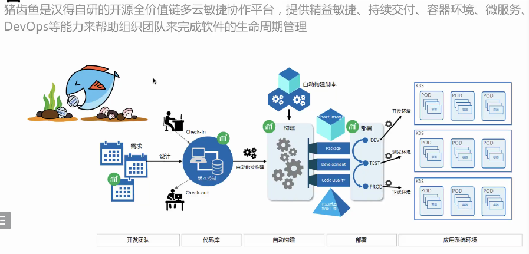
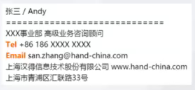
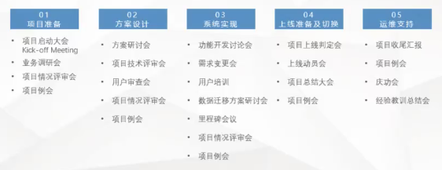
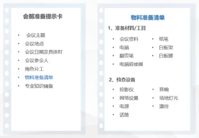
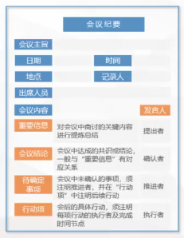
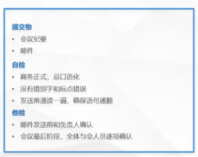

# 汉得培训

## 0718

- 客户关系管理系统，ERP，营销
- 目的：认识系统  （两周半上课）；使用封装好的前后端组件

### link开发-入场指南

- 公司系统应用

门户：请假/休假（提前)请两天以上的病假需开证明，一天可以

- 企业邮箱

PS: 邮箱后面带上个人信息（姓名、手机号、部门）

- 手机下载：海马汇（打卡）、汇联易（报销，项目-2022培训xx；出差机票预订）

- 工资发放：每月5号

- 办公时间

上班最晚不得晚于9:10，如果前一天晚上加班很晚可以晚到

- 着装：在客户那里尽量是有领上衣，开会/客户高层-正装

- 接电话可以去两边的会议室/

- 开发工具

​		Axure，Xmind（思维导图），RedisDesktopManger（数据库），Swagger（接口）

​	猪齿鱼

​	

​	账号为员工工号

- git
  - dev-姓名
  - 分支：加上日期
  - 提交申请合并--技术经理检查--合并copy分支--测试环境
  - 

### 工作邮件

- 使用hand邮箱发工作邮件
- **收件人**需要知晓并参与邮件的内容，而**抄送人**只需要知晓邮件的内容即可。
- 排序规则
  - 先外后内
  - 销售部>> 
  - 姓名首字母

- 主题
  - 明确简短，可追溯性
  - 【】强调关键词
    - 【通知】5.24技能课程信息
  - 定期邮件的主题格式要保持一致
    - 【周报】xx双周工作汇报05053-0516

- 正文

  - 称呼：姓名+职务，万能称呼：xx老师

  - 问候语：你好/早上好/大家好，首次给对方发邮件要做简单的自我介绍

  - 详细事宜：

    - 邮件体，
    - 倒金字塔结构：结果先行（做什么，重要性，影响性
    - 排版：分条陈述，一行只陈述一个逻辑，顶格写

  - 结束语：期望、保持沟通、感谢

  - 签名：默认签名、签名格式

    

- 附件
  - 命名应商务正式，概括文件内容
  - 正文里要对附件进行简要说明
  - 如果文件格式特殊，需说明可用什么工具打开
  - 附件数目不宜超过4个，超过则使用压缩文件发送

- 回复
  - 直接回复：只回复发件人，只附带正文
  - 全部回复：回复所有人包括发件人和抄送者
  - 设置自动回复：如果暂时无法及时回复邮件

- 邮件发送
  - 抄送/密送自己（备份）
  - 设置延迟发送（防止错发/漏发）

### 会议

会议种类

会前准备

会议纪要

​	讯飞，语音转文字，会议记录

会后整理

